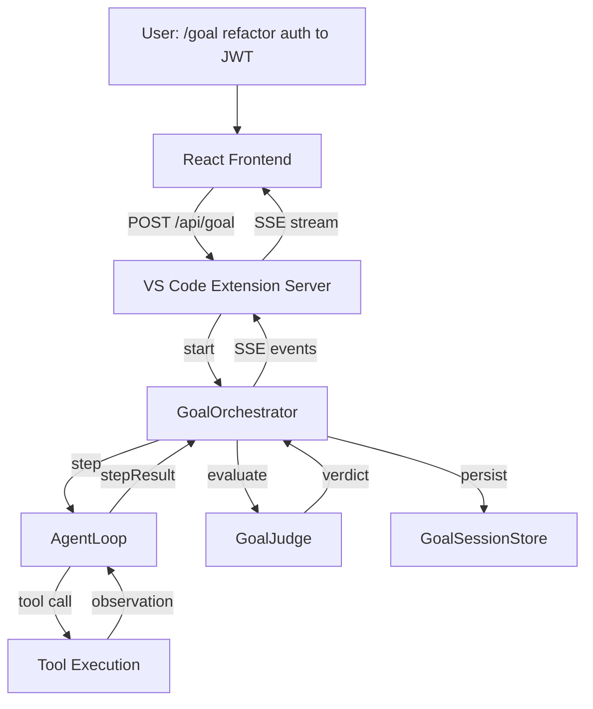

# Design: /goal Autonomous Agent Loop (Goal Loop)

**Date:** 2026-05-22
**Status:** Approved
**Author:** AI Assistant

## 1. Overview

Implement a `/goal` command that puts cvr.name.coder into an autonomous agent loop similar to Codex CLI's `/goal` and Claude Code's goal mode. The agent works iteratively toward a user-defined goal with measurable success criteria, automatically continuing until the goal is achieved or a hard limit is reached.

### Key Behaviors
- User types `/goal <description>` with optional success criteria.
- Agent executes one step per iteration (think -> act -> observe).
- After each step, a **Judge** evaluates whether the goal is met.
- If not met, the orchestrator automatically appends context and continues.
- The loop persists across VS Code panel reloads via disk-backed session state.
- Progress is streamed to the frontend via SSE.
- User can abort at any time.

## 2. Architecture



### Components

1. **GoalOrchestrator** (`src/server/goalOrchestrator.ts`)
   - Manages the full lifecycle of a goal session.
   - Delegates single-step execution to `AgentLoop`.
   - Calls `GoalJudge` after every step.
   - Handles safety limits: maxIterations, maxTokens, maxDuration, abort.
   - Persists state via `GoalSessionStore`.
   - Emits events via `GoalEventBroadcaster`.

2. **GoalJudge** (`src/server/goalJudge.ts`)
   - Pure evaluator. Takes goal, successCriteria, step history, last observation.
   - Calls LLM with a strict judge prompt.
   - Returns structured verdict: `{ verdict: 'COMPLETE' | 'INCOMPLETE', reason, nextHint }`.
   - Hardcoded strict prompt by default.

3. **GoalSessionStore** (`src/server/goalSessionStore.ts`)
   - Saves `GoalState` JSON files to extension storage (`storagePath/goal-<id>.json`).
   - Supports `create`, `load`, `save`, `list`, `delete`.
   - Enables resume after VS Code reload or panel close.

4. **GoalEventBroadcaster** (`src/server/goalEventBroadcaster.ts`)
   - Thin SSE abstraction.
   - Emits typed events: `goal.started`, `goal.step`, `goal.judge`, `goal.complete`, `goal.error`, `goal.aborted`.

5. **API Routes** (in `extension.ts`, new section after `/api/agent/loop`)
   - `POST /api/goal` — start goal, returns `{ goalId }`.
   - `GET /api/goal/:id` — get current `GoalState`.
   - `GET /api/goal/:id/events` — SSE event stream.
   - `POST /api/goal/:id/abort` — abort running goal.
   - `POST /api/goal/:id/resume` — resume a paused goal.

6. **Frontend** (`src/hooks/useGoal.ts`, `src/components/goal/GoalPanel.tsx`)
   - Parses `/goal` command in `App.tsx`.
   - Shows timeline of steps, judge verdicts, progress bar.
   - Abort button. Resume prompt after reload.

## 3. Data Models

### GoalConfig
```typescript
interface GoalConfig {
  goal: string;
  successCriteria?: string;
  maxIterations?: number;      // default: 50
  maxTokens?: number;          // default: 500000 (soft)
  maxDurationMinutes?: number; // default: 120
  provider: string;
  model: string;
  apiKey?: string;
  agent?: string;
}
```

### GoalState
```typescript
interface GoalState {
  id: string;
  goal: string;
  successCriteria: string;
  config: GoalConfig;
  status: 'running' | 'paused' | 'completed' | 'error' | 'aborted';
  currentIteration: number;
  maxIterations: number;
  steps: GoalStep[];
  judgeHistory: JudgeVerdict[];
  totalTokensUsed: number;
  startedAt: number;
  updatedAt: number;
  completedAt?: number;
  error?: string;
}
```

### GoalStep
```typescript
interface GoalStep {
  iteration: number;
  thought: string;
  action?: { tool: string; params: Record<string, unknown> };
  observation?: string;
  timestamp: number;
}
```

### JudgeVerdict
```typescript
interface JudgeVerdict {
  iteration: number;
  verdict: 'COMPLETE' | 'INCOMPLETE';
  reason: string;
  nextHint?: string;
  timestamp: number;
}
```

### GoalEvent
```typescript
interface GoalEvent {
  type: 'goal.started' | 'goal.step' | 'goal.judge' | 'goal.action' | 'goal.observation' | 'goal.complete' | 'goal.error' | 'goal.aborted';
  goalId: string;
  timestamp: number;
  data: any;
}
```

## 4. Execution Flow

1. **Start:**
   - User sends `/goal refactor auth to JWT — success: all tests pass`.
   - `App.tsx` detects `/goal` prefix, extracts goal and optional criteria.
   - Calls `POST /api/goal` with `GoalConfig`.
   - Server creates `GoalState`, persists to disk.
   - Opens SSE stream at `/api/goal/:id/events`.

2. **Loop:**
   - `GoalOrchestrator` calls `AgentLoop` for a **single step** via new method `runSingleStep()`.
   - `AgentLoop` runs exactly one iteration of its internal `think → act → observe` cycle and returns a `LoopStep` (thought, optional action, optional observation).
   - Event `goal.step` broadcast.
   - `GoalOrchestrator` calls `GoalJudge.evaluate(...)`.
   - Judge returns verdict.
   - Event `goal.judge` broadcast.
   - If `COMPLETE` → finalize, save, emit `goal.complete`.
   - If `INCOMPLETE` → append `nextHint` to context, increment iteration, continue.

3. **Limits:**
   - If `currentIteration >= maxIterations` → abort with error "Max iterations reached".
   - If `totalTokensUsed >= maxTokens` → abort with error "Token budget exhausted".
   - If elapsed time >= `maxDurationMinutes` → abort with error "Time limit exceeded".
   - User clicks Abort → emit `goal.aborted`, save state.

4. **Resume:**
   - On VS Code startup, `GoalSessionStore.list()` checks for active goals.
   - If found, frontend shows "Resume goal <id>?" banner.
   - `POST /api/goal/:id/resume` reloads state and restarts loop.

## 5. Judge Prompt (Hardcoded Strict)

```text
You are a strict evaluator. A coding agent is working on this goal:

GOAL: {goal}

SUCCESS CRITERIA (ALL must be demonstrably true to mark COMPLETE):
{successCriteria}

AGENT'S PROGRESS SO FAR:
{formattedHistory}

AGENT'S LAST ACTION RESULT:
{lastObservation}

RULES:
- Verify EVERY success criterion with concrete evidence. Do not trust the agent's claims.
- If a criterion requires files/tests/commands, confirm they exist and pass.
- If ANY criterion is unmet, respond INCOMPLETE.
- Give ONE concrete next step in nextHint.

Respond ONLY in JSON:
{
  "verdict": "INCOMPLETE" | "COMPLETE",
  "reason": "specific evidence-based explanation",
  "nextHint": "one concrete next action for the agent"
}
```

## 6. Safety & Error Handling

| Limit | Default | Action on breach |
|-------|---------|------------------|
| maxIterations | 50 | Abort, save partial state |
| maxTokens | 500000 | Abort |
| maxDurationMinutes | 120 | Abort |
| abort signal | user | Immediate stop, save as `aborted` |
| SSE disconnect | — | Goal continues in extension background. Reconnect loads current state + subscribes to new events. |
| LLM failure | — | Retry 3x with backoff. Then pause with `error` status. User can resume. |
| Invalid judge JSON | — | Treat as INCOMPLETE with generic hint. |

All tool calls still route through existing `PermissionEngine`. Cost tracking uses existing `trackCost()`.

## 7. Frontend Integration

- `parseCommand` in `App.tsx` updated to detect `/goal`.
- `useGoal` hook manages SSE connection, state updates, abort.
- `GoalPanel` component shows:
  - Header: goal text + status badge.
  - Progress: iteration X / Y, tokens used / max.
  - Timeline: steps with thought (collapsible), action badge, observation status.
  - Judge verdicts: green check or yellow arrow with tooltip.
  - Abort button.
  - Resume banner if paused goals exist.
- On completion/abortion, UI returns to normal chat with a summary system message.

## 8. Files to Create / Modify

**New files:**
- `src/types/goal.ts`
- `src/server/goalOrchestrator.ts`
- `src/server/goalJudge.ts`
- `src/server/goalSessionStore.ts`
- `src/server/goalEventBroadcaster.ts`
- `src/hooks/useGoal.ts`
- `src/components/goal/GoalPanel.tsx`

**Modify:**
- `src/server/agentLoop.ts` — add `runSingleStep()` method that executes exactly one think/act/observe cycle and returns `LoopStep`. Extract internal `think()` and `executeAction()` logic to support this.
- `src/types/agent.ts` — add `GoalEvent` import or merge.
- `vscode/src/extension.ts` — add `/api/goal` routes.
- `src/App.tsx` — parse `/goal`, integrate `useGoal`, conditionally render `GoalPanel`.
- `src/utils/commands.ts` — update `parseCommand` to detect `/goal` prefix and extract goal text + optional criteria.

## 9. SSE Reconnect Behavior

When the frontend SSE connection drops (e.g., VS Code panel closed):
1. The `GoalOrchestrator` continues running in the extension host process.
2. On reconnect, the client calls `GET /api/goal/:id` to receive the current `GoalState` snapshot (includes full step history).
3. The client then opens a new SSE stream at `/api/goal/:id/events` to receive only **future** events.
4. Historical events are **not** replayed via SSE; the client reconstructs the timeline from `GoalState.steps` and `judgeHistory`. This avoids complexity of event buffering.

## 10. Risks & Mitigation

| Risk | Mitigation |
|------|------------|
| Infinite token burn | Hard limits + cost tracking + user-visible progress |
| Judge too lenient | Strict hardcoded prompt + require concrete evidence |
| Judge too strict / loops forever | User can abort + maxIterations cap |
| SSE disconnect loses progress | Goal runs in extension process + disk persistence |
| Complex frontend state | `useGoal` hook abstracts SSE + state management |

## 11. Acceptance Criteria

- [ ] `/goal create 4 files in temp folder named note1..note4 one per iteration` completes in ~4 iterations with files verified.
- [ ] `/goal migrate auth to JWT — success: all tests pass` loops until tests green or max iterations.
- [ ] Abort button stops goal immediately and saves partial state.
- [ ] Closing and reopening VS Code panel allows resuming active goal.
- [ ] SSE stream shows real-time step + judge events.
- [ ] Cost is tracked for every agent think + judge call.
